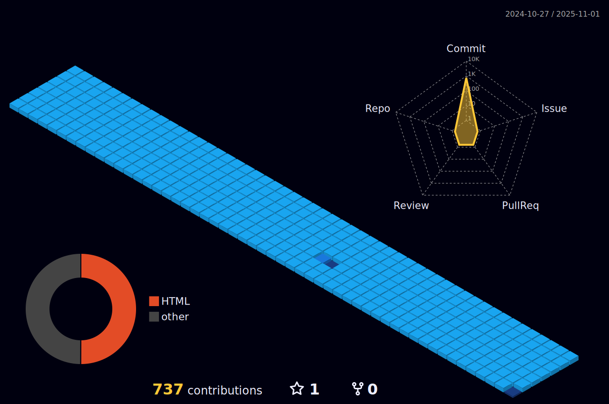

##

##

 
 
  <a href="https://https://github.com/almircs/html-css">
  
  

  
  ##
 
  

 
 
 
   

 
 
 
 
  
  
  
  
  
 
  

 
 ##
 
 

<table border="2" align="">
<tr>
<th>DESENVOLVENDO</th>
<th> DADOS</th>
</tr>
<tr>
<td>Linguagem</td>
 <td>
  
  
  
      
 </td>
</tr>
<tr>
<td>Domínio</td>
<td>

</td>
</tr>
<tr>
<td>Databases</td>
<td>

</td>
</tr>
<tr>
<td>OS</td>
<td>

</td>
</tr>
<tr>
<td>CI/CD</td>
<td>

  
</td>
</tr>

</table>

##
 
 
 

 
 
 
   

 
    
    
   
 
 

  
  ##
 

 
 
  

##

 

<!--   profile-green-animate -->

##

##

 
 
 
 

##

##

### 📈 GitHub Activity Graph:

##
